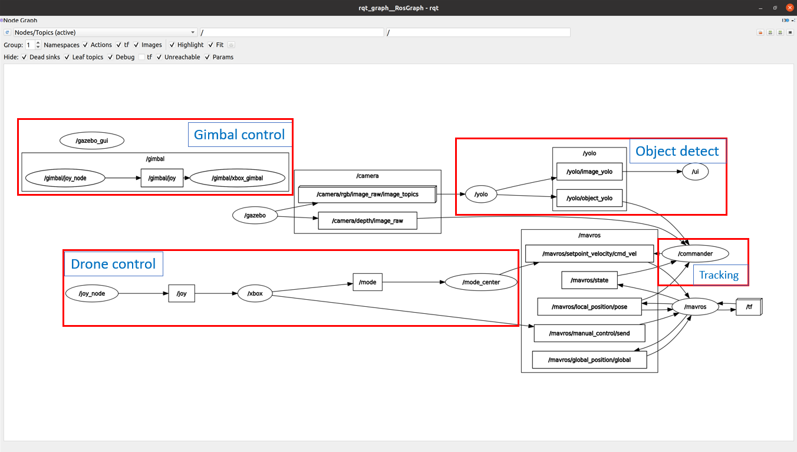
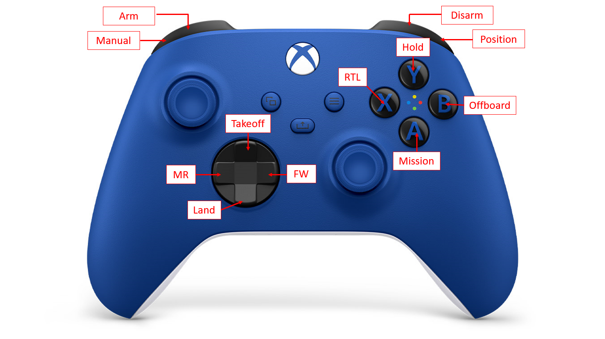
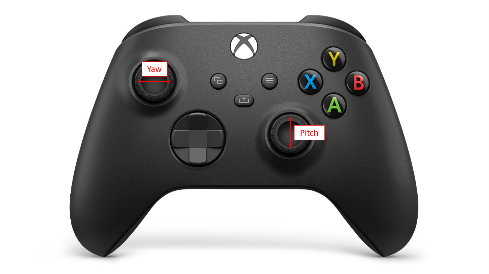
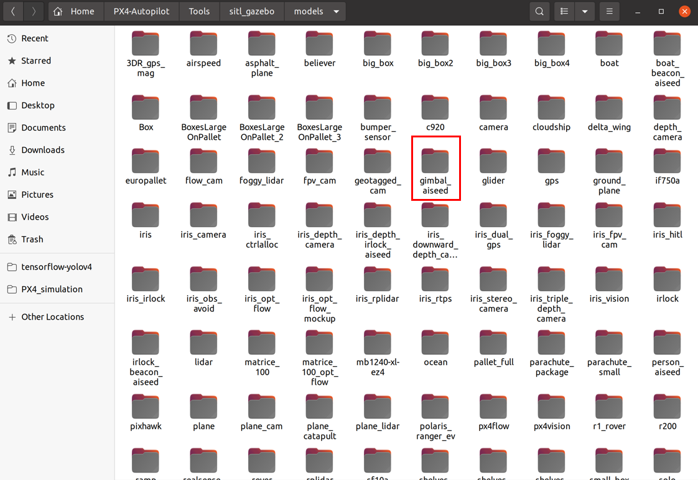
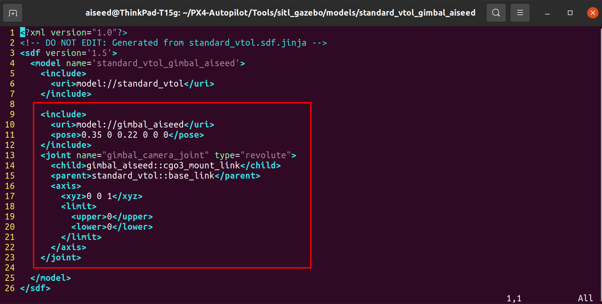
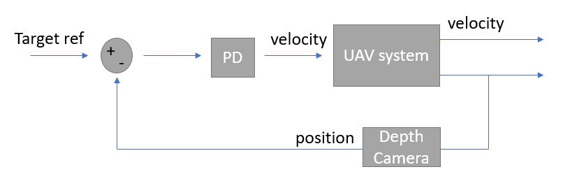
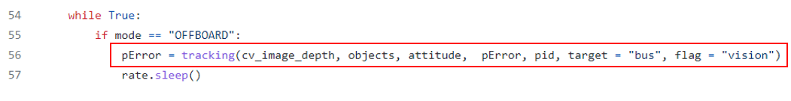

# PX4_simulation
Drone simulation in gazebo
> **Note** This simulation environment is built in ubuntu 20.04

# Contents

* [Github Setting](#github-setting)
* [Installation](#installation)
* [Usage](#usage)
    * [Structure](#structure)
    * [Joysticks](#joysticks)
    * [Sensor](#sensor)
    * [Convention](#convention)
* [Function](#function)
    * [Tracking](#tracking)
    * [Gimbal Control](#gimbal-control)
    * [Obstacle Avoidance](#obstacle-avoidance)
* [Known issues](#known-issue)
* [Reference](#reference)

# Github setting

* being a contributor of this repository and [sitl_gazebo](https://github.com/Aiseed/sitl_gazebo) and [.bash](https://github.com/Aiseed/.bash)

* setting ssh key

  > **Note** please refer to [this website](https://blog.jaycetyle.com/2018/02/github-ssh/)

# Installation
* update & upgrade ubuntu

        sudo apt-get update
        sudo apt-get upgrade

* install vim 
        
        sudo apt-get install vim
        
* install ros noetic

  1. Add ROS to sources.list:
     
         sudo sh -c 'echo "deb http://packages.ros.org/ros/ubuntu $(lsb_release -sc) main" > /etc/apt/sources.list.d/ros-latest.list'
         sudo apt install curl # if you haven't already installed curl
         curl -s https://raw.githubusercontent.com/ros/rosdistro/master/ros.asc | sudo apt-key add -
         sudo apt update
     

  1. Install ROS with Gazebo:

         sudo apt install ros-noetic-desktop-full
         source /opt/ros/noetic/setup.bash

  1. Install and initialize rosdep.

         sudo apt install python3-rosdep python3-rosinstall python3-rosinstall-generator python3-wstool build-essential
         sudo apt install python3-rosdep
         sudo rosdep init
         rosdep update

  1. ros test

         roscore
  
  > **Note** please refer to [this website](http://wiki.ros.org/noetic/Installation/Ubuntu) to get more installation details

* install mavros
      
      cd ~
      sudo apt-get install ros-noetic-mavros ros-noetic-mavros-extras

* install GeographicLib datasets
      
      cd ~
      wget https://raw.githubusercontent.com/mavlink/mavros/master/mavros/scripts/install_geographiclib_datasets.sh
      sudo bash ./install_geographiclib_datasets.sh

* install joystick dependencies

      sudo apt-get install ros-noetic-joy
      sudo apt-get install libspnav-dev libbluetooth-dev libcwiid-dev

* install obstacle avoidance dependencies
      
      sudo apt install ros-noetic-stereo-image-proc ros-noetic-image-view
      sudo apt install libpcl1 ros-noetic-octomap-*
      # Gstreamer plugins (for Gazebo camera)
      sudo apt install gstreamer1.0-plugins-bad gstreamer1.0-plugins-base gstreamer1.0-plugins-good gstreamer1.0-plugins-ugly libgstreamer-plugins-base1.0-dev
      
* install PX4_simulation package (using ssh)
      
      cd ~
      mkdir -p ~/PX4_simulation_ws/src
      cd ~/PX4_simulation_ws/src
      git clone --recursive git@github.com:Aiseed/PX4_simulation.git
      
* remove global plannar which is in PX4-Avoidance package (this package will result in a failed catkin_make process, and we don't the reason so far. QQ...)
      
      rm -r ~/PX4_simulation_ws/src/PX4_simulation/PX4-Avoidance/global_planner

* make this working space

      cd ~/PX4_simulation_ws
      catkin_make
    
* install PX4-Autopilot package (using ssh)
      
      cd ~
      git clone --recursive git@github.com:Aiseed/PX4-Autopilot.git

* checkout the correct branch

      cd ~/PX4-Autopilot
      git checkout simulation
      
* install ubuntu.sh (includes all the dependency required by the simulation tools)
      
      cd ~
      bash ./PX4-Autopilot/Tools/setup/ubuntu.sh
      
* install .bash file (using ssh)
      
      cd ~
      git clone git@github.com:Aiseed/.bash.git

* source bash file (add environment variable)
  * open the .bashrc file
  
          cd ~
          vim ~/.bashrc
        
  * add the below to the bottom of .bashrc file
        
          source ~/.bash/.ros_bash
          source ~/.bash/.px4_bash
          source ~/.bash/.env_bash # (for tracking)

  * source bash file

          source ~/.bashrc

* make simulation
        
        cd ~/PX4-Autopilot
        make px4_sitl gazebo

* download weight for object detection
  * download tiny-yolov4.weight from [here](https://github.com/AlexeyAB/darknet/releases/download/darknet_yolo_v4_pre/yolov4-tiny.weights)
        
        mv ~/Downloads/yolov4-tiny.weights ~/PX4_simulation_ws/src/PX4_simulation/object_detection/src/tensorflow-yolov4/data
        
  * install tensorflow
        
        pip3 install tensorflow
        pip3 install easydict
        
  * convert darknet weights to tensorflow
        
        cd ~/PX4_simulation_ws/src/PX4_simulation/object_detection/src/tensorflow-yolov4
        python3 save_model.py --weights ./data/yolov4-tiny.weights --output ./checkpoints/yolov4-tiny-416 --input_size 416 --model yolov4 --tiny
        
  * test
        
        cd ~/PX4_simulation_ws/src/PX4_simulation/object_detection/src/tensorflow-yolov4
        python3 detect.py --weights ./checkpoints/yolov4-tiny-416 --size 416 --model yolov4 --image ./data/kite.jpg --tiny

        
* quick test
  * launch with quadcopter(without AI, gimbal control and tracking)
        
        roslaunch control px4_mavros_joy.launch
      
      > **Note** you can launch with parameter "type" to launch different type of vehicles 
        
        roslaunch control px4_mavros_joy.launch type:=_vtol
      
      >  **type lists** :
      >  
      >  _vtol
      >  
      >  _vtol_gimbal
      >  
      >  _vtol_gimbal_irlock
      >  
      >  _hex_gimbal

# Usage
### Structure

### Joysticks
* vehicle joy mapping
  

* gimbal joy mapping
  

### Sensor
* this section will teach you how to add customized on the vehicle
  
  ex. adding gimbal on the vtol
      
  1. find the gimbal sensor in the following path ***~/PX4-Autopilot/Tools/sitl_gazebo/models***
       
  1. add this sensor in the vtol with the following format and define gimbal's pose
     
  1. done !!!
 
### Convention
* every modified models are all located in the ***~/PX4-Autopilot/Tools/sitl_gazebo/models*** with postfix ***aiseed***
* every modified worlds are all located in the ***~/PX4-Autopilot/Tools/sitl_gazebo/worlds*** with postfix ***aiseed***
* every modified posix launch files are all located in the ***~/PX4-Autopilot/launch*** with postfix ***aiseed***
* most of the often-use launch file are located in the ***control*** package 
* launch files' name follows the rules below

       (function)_(function)_(function)_(function).launch
   
   >  Function lists
   >  
   >  mavros : ros & mavlink bridge
   >  
   >  px4 : px4 firmware simulator
   >  
   >  joy : joysticks driver
   >  
   >  ui : objection detection & user interface
   
   ex. if you want to test the function of mavros px4 and with joysticks control, you can use
   
       roslaunch control px4_mavros_joy.launch
       
   if you want to add the function of object detection
       
       roslaunch control ui_px4_mavros_joy.launch
   

# Function
### Tracking
> **Note** this function is specific to multiroter
>
> **Note** you need to turn on **ui** function
>
#### Quick Start
ex. 

    roslaunch control ui_px4_mavros_joy.launch
    
and open the second terminal, run

    rosrun commander commander_offboard.py
    
you can fly to aiseed person, and ensure the detection result showing on the ui. Then you can switch to offboard mode, the drone should start to follow the aiseed person(you can choose the following target by modifying ***commander_offboard.py***)

> **Note** feel free to implement any offboard mode function in the ***commander_offboard.py***. ex. tracking, path planning, obstacle avoidance ...etc.  

#### Algorithm
* Block Diagram
  
   

   It is a classical PID control with visual servo.

* Tracking function usage
   
   

   > Parameters :
   >
   > cv_image_depth : depth image  
   >
   > objects : message type = **ObjectsArray**, incorporting multiple [Objects](https://github.com/Aiseed/PX4_simulation/blob/main/object_detection/msg/Objects.msg) messages
   >
   > attitude : local NED/ENU frame
   >
   > pError : previous x, y, z error
   >
   > pid : pid 
   > 
   > target : 1 of 80 coco dataset flags
   >
   > flag : "default" or "vision"

### Gimbal Control
> **Note** you need two xbox joysticks to control vehicle and gimbal at the same time
> 
> **Note** this function is specific to using *type:=_vtol_gimbal*
> 
> **Note** please refer to [this website](https://mavlink.io/en/services/gimbal_v2.html) and [this website](https://docs.px4.io/master/en/advanced/gimbal_control.html)to get more gimbal control information

#### Quick Start
ex. 

    roslaunch control px4_mavros_joy.launch type:=_vtol_gimbal
    
and open the second terminal, run

    rosrun gimbal_control xbox_gimbal.py

#### Algorithm
* parameter setting through QGC
   * `MNT_MODE_IN` to ***MAVlink gimbal protocol v2***
   * `MNT_MODE_OUT` to ***MAVlink gimbal protocol v2***

### Obstacle Avoidance
> **Note** we only use *local_planner*
> 
> **Note** you can change **obstacle_cost_param_** which represents the distance between obstacle and the drone that will dominate the cost function by running `rosrun rqt_reconfigure rqt_reconfigure` 

#### Simulation

       roslaunch local_planner local_planner_depth-camera.launch
    
> **Note** you can turn on gazebo client by modifying *argument gui* into *true* which is located in the ***avoidance_sitl_mavros.launch***

#### Hardware

> Companion computer : Nvidia Xavier NX (ubuntu 18.04)
>
> FCU : pixhawk
>
> Camera : Realsense D435

* Layout

* Pixhawk setting

   Parameters to set through QGC:
   * `COM_OBS_AVOID` to ***Enabled***
   * `MAV_1_CONFIG`, `MAV_1_MODE`, `SER_TEL2_BAUD` to enable MAVLink on a serial port. For more information: [PX4 Dev Guide]     (http://dev.px4.io/en/companion_computer/pixhawk_companion.html#pixhawk-setup)

* Companion computer setting

   1. installing ros-melodic

        1. Add ROS to sources.list:
     
               sudo sh -c 'echo "deb http://packages.ros.org/ros/ubuntu $(lsb_release -sc) main" > /etc/apt/sources.list.d/ros-latest.list'
               sudo apt install curl # if you haven't already installed curl
               curl -s https://raw.githubusercontent.com/ros/rosdistro/master/ros.asc | sudo apt-key add -
               sudo apt update
     

        1. Install ROS with Gazebo:

               sudo apt install ros-melodic-desktop-full
               source /opt/ros/melodic/setup.bash

        1. Install and initialize rosdep.

               sudo apt install python3-rosdep python3-rosinstall python3-rosinstall-generator python3-wstool build-essential
               sudo apt install python3-rosdep
               sudo rosdep init
               rosdep update

        1. ros test

               roscore  

   1. installing realsense camera driver and ros wrapper
      
          sudo apt-get install ros-melodic-realsense2-camera
   
   1. installing mavros
          
          cd ~
          sudo apt install ros-melodic-mavros ros-melodic-mavros-extras
          wget https://raw.githubusercontent.com/mavlink/mavros/master/mavros/scripts/install_geographiclib_datasets.sh
          chmod +x install_geographiclib_datasets.sh
          sudo ./install_geographiclib_datasets.sh
          
   1. install avoidance package
         
          cd ~
          mkdir -p ~/obs_ws/src
          cd ~/obs_ws/src
          git clone --recursive git@github.com:PX4/PX4-Avoidance.git
          cd ..
          catkin_make
          
   1. create avoidance launch file

          cd ~/obs_ws/PX4-Avoidance/tools
          mv generate_launchfile.sh.deprecated generate_launchfile.sh
          export CAMERA_CONFIGS="camera_main,realsense,828112073098,0,0,0,0,0,0"
          . generate_launchfile.sh
   
   1. launch avoidance file
          
          sudo chmod 666 /dev/ttyTHS0 
          roslaunch local_planner avoidance.launch fcu_url:=/dev/ttyTHS0:921600

> **Note** 828112073098 is a serial number representing realsense d435
> 
> **Note** avoidance.launch only works in an environment that possesses a good GPS signal and a connection with pixhawk
>
> **Note** please refer to [this website](https://github.com/Aiseed/PX4-Avoidance) to get more OA detailed information

# Known issues
## Cuda installation
   After installing cuda and cudnn, the object detection will not work correctly.
## Simulation Video streaming
   Only if ui function starts, the QGC can recieve video streaming.
## Companion computer and pixhawk orange cube connection problems
   When connecting xavier and orange cube with txrx, the computer will not recieve any data from orange cube (not seen with pixhawk 1)

# Reference

* [Px4 userguide](https://docs.px4.io/main/en/)
* [GGC userguide](https://docs.qgroundcontrol.com/master/en/)
* [Mavlink userguide](https://mavlink.io/en/)
* [Mavros userguide](http://wiki.ros.org/mavros)
